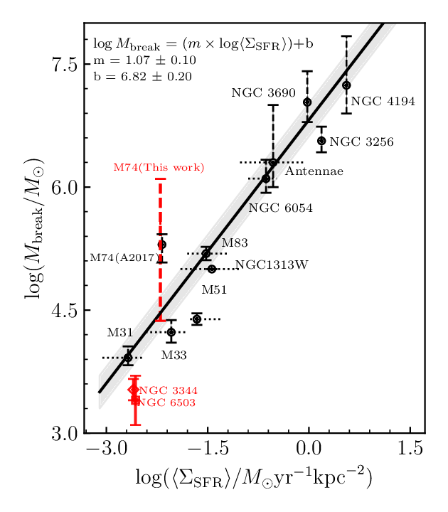

# Cluster Demographics Pipeline

This workspace contains the current LEGUS + SLUG forward-modelling pipeline for
inferring young star cluster population parameters from integrated photometry.
The main production analyzer is:

```text
pipeline/bundled_pipeline/analyze_catalog_mid_mdd.py
```

In older notes and job names this is sometimes shortened to
`analyze_mid_mdd.py`. The active file name in this repository is
`analyze_catalog_mid_mdd.py`.

## Science Background

The goal is to infer the underlying cluster population distribution from
observed multi-band cluster photometry without assigning every cluster a single
best mass and age first. This matters because unresolved clusters have
stochastic IMF sampling, age-extinction degeneracy, photometric errors, and
selection effects. A hard mass-age completeness cut removes many clusters and
can bias the inferred population.

This pipeline follows the Bayesian forward-modelling strategy used in Tang,
Grasha & Krumholz (2024), MNRAS 532, 4583:

<https://academic.oup.com/mnras/article/532/4/4583/7720539>

The key idea is to compare the observed photometry directly against a synthetic
SLUG cluster library. The model reweights library clusters by a parametric
population model, folds in observational completeness through `pobs`, and
evaluates the likelihood in observed magnitude space.

The commonly used baseline for the cluster mass function is a power law with
`alpha_M = -2`. The truncated model generalizes this by adding an exponential
high-mass cutoff:

```text
dN/dM proportional to M^alpha_M exp(-M / M_break)
```

`M_break` is the truncation mass. Physically, it is interpreted as the mass
scale above which cluster formation becomes inefficient or rare. A central
science question is whether `M_break` depends on galactic environment, usually
parameterized by star formation rate surface density, `Sigma_SFR`.

## Environmental Effect: Truncation Mass vs Sigma_SFR

The figure below shows the empirical relation used as an environment-effect
diagnostic. It compares cluster mass-function truncation mass against SFR
surface density. The plotted fit is:

```text
log M_break = (1.07 +/- 0.10) log Sigma_SFR + (6.82 +/- 0.20)
```

Higher `Sigma_SFR` systems tend to have higher `M_break`, consistent with the
picture that high-pressure, high-SFR-density environments can form more massive
bound clusters. Low-`Sigma_SFR` galaxies such as NGC 3344 and NGC 6503 sit near
the low-truncation-mass end of the relation.



Original PDF: [`trM_updated_July4th.pdf`](trM_updated_July4th.pdf)

## What `analyze_catalog_mid_mdd.py` Does

The analyzer fits a parametric cluster population model to one or more LEGUS
catalogues using SLUG/cluster_slug likelihoods and `emcee` MCMC.

Main inputs:

- A SLUG cluster library path, passed as `libdir`.
- The mass, age, and extinction PDFs used to generate the SLUG library.
- LEGUS catalogues, either passed directly or discovered with `--galaxy-names`.
- NN completeness artifacts from `--nn-comp-dir` or explicit `--nn-scaler` and
  `--nn-model`.
- A `pobs` mode defining how the library selection probability is computed.

Main outputs:

- An HDF5 MCMC chain written by `emcee.backends.HDFBackend`.
- By default, output chains are placed under `--output-mcmc-chains-dir`.
- Each sample contains the fitted demographic parameters and extinction
  nuisance parameters.

## Model Parameters

For the default MID model, the parameter vector is:

```text
0: alpha_M
1: log10(M_break)
2: alpha_T
3: log10(T_MID / yr)
4+: log p(A_V) control points
```

For the MDD model, enabled with `--mdd`, the first two parameters are the same,
but the age/disruption parameters become:

```text
2: gamma_MDD
3: log10(T_MDD,min / yr)
```

The analyzer supports:

- `--trun`: truncated mass function.
- `--pl`: pure power-law model.
- `--mdd`: mass-dependent disruption instead of MID.
- `--nav`: number of extinction-distribution control intervals.
- `--nwalkers`, `--niter`, `--restart`: MCMC controls.

## Completeness and `pobs`

The analyzer uses completeness in two places:

1. Observed catalogue cleaning through `clean_legus`, controlled by
   `--comp-threshold`.
2. Library selection probability, passed to `cluster_slug.add_filters(...,
   pobs=...)`.

The important current flag is:

```text
--pobs-mode {observed-box,nn,hybrid}
```

Modes:

- `observed-box`: default. Compute NN completeness for library photometry, then
  mask the library to the observed absolute-magnitude box.
- `nn`: use direct NN completeness without the observed-box mask.
- `hybrid`: legacy stricter logic combining observed-box cuts, per-band rules,
  V-band cuts, B/I requirements, and NN completeness.

Related controls:

```text
--hybrid-range-margin
--hybrid-min-bands-nonzero
--hybrid-nn-batch-rows
--lib-vmag-max
```

For the NGC 3344 jobs in this workspace, the current wrapper scripts use:

```text
--pobs-mode observed-box
--hybrid-range-margin 0.05
```

The scientific interpretation of `alpha_M` and `M_break` is sensitive to this
completeness treatment. If `pobs` is overestimated near the dim end, the model
can overpredict how many faint clusters should be observed unless it changes the
population parameters. That is why the observed-box, NN-only, hybrid, bright-cut,
and shifted-completeness tests are useful A/B checks.

## Typical NGC 3344 Job Files

Job scripts live in:

```text
pipeline/scripts/nn_mid_mdd_jobs/
```

Important examples:

```text
ngc3344_mid.sh
ngc3344_mid_pobs_hybrid_mv6.sh
ngc3344_mid_test_bright_vcut_m65.sh
ngc3344_mid_test_pobs_shift_minus1.sh
```

The test-pobs analyzer variant is:

```text
pipeline/bundled_pipeline/analyze_catalog_mid_mdd_test_pobs.py
```

It keeps the main analyzer logic but adds controlled experiments for:

- fitting only clusters brighter than absolute `M_V = -6.5`;
- shifting the completeness model by `-1` mag in apparent magnitude space.

## Interpreting `alpha_M` and `M_break`

`alpha_M` controls the low/intermediate-mass slope, while `M_break` controls the
high-mass truncation. They can be partially degenerate in small catalogues:

- A shallow `alpha_M` reduces the number of low-mass/faint clusters.
- A low `M_break` suppresses high-mass/bright clusters.
- If both the dim end and bright end are sparsely populated, the likelihood may
  prefer a flatter slope plus a low truncation mass, especially if completeness
  near the dim end is uncertain.

For environmental interpretation, `M_break` is the more direct quantity to
compare against `Sigma_SFR`. The figure above demonstrates the expected trend:
galaxies with higher SFR surface density tend to have higher truncation masses.

## References

- Tang, J., Grasha, K., & Krumholz, M. R. 2024, MNRAS, 532, 4583,
  "Cluster population demographics in NGC 628 derived from stochastic
  population synthesis models",
  <https://doi.org/10.1093/mnras/stae1799>
- Krumholz et al. 2019, Bayesian forward modelling with stochastic cluster
  population synthesis.
- LEGUS survey: Calzetti et al. 2015.
